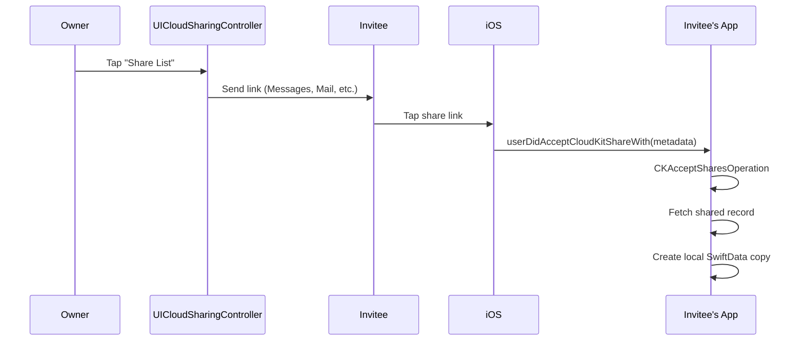
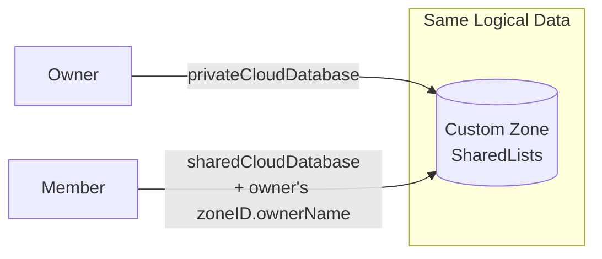
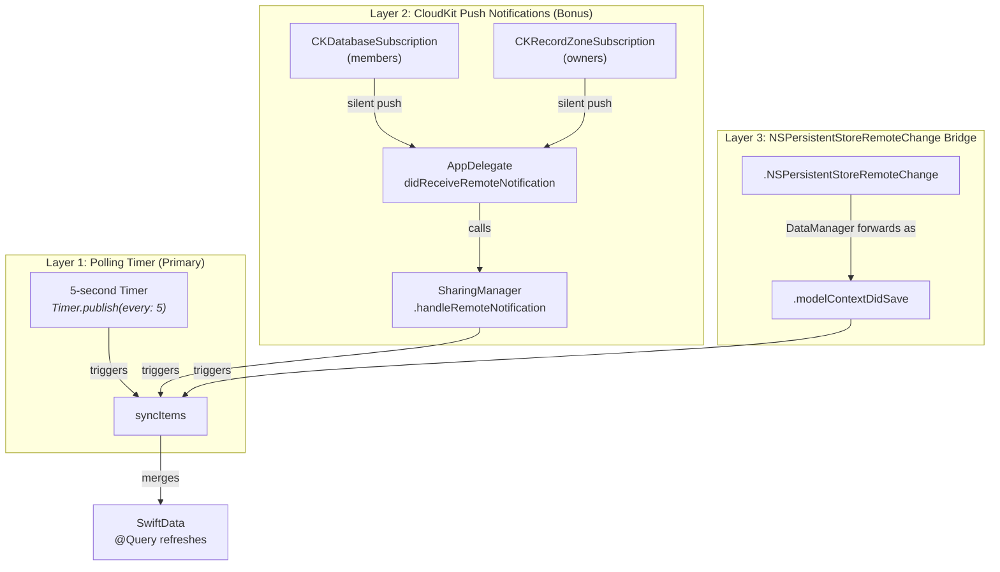
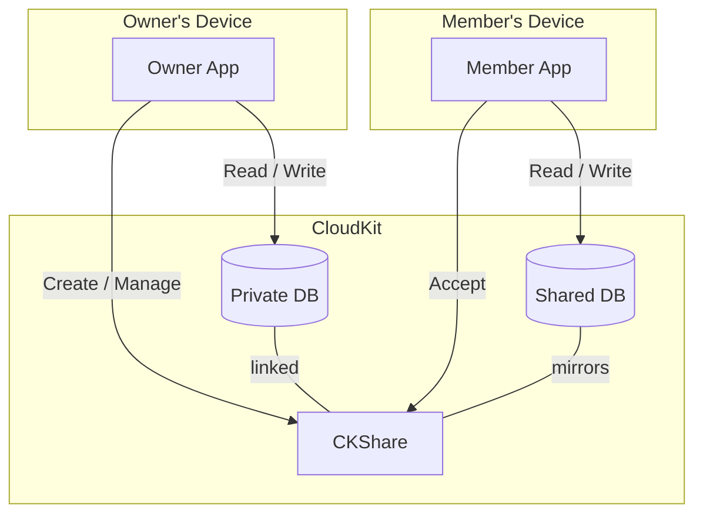
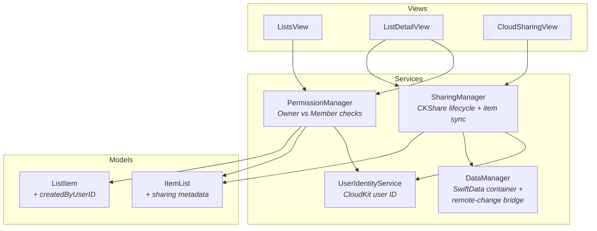
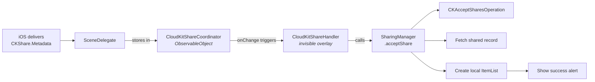
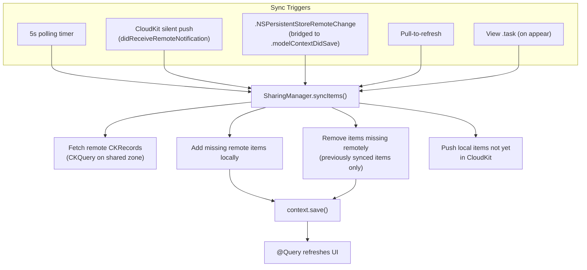
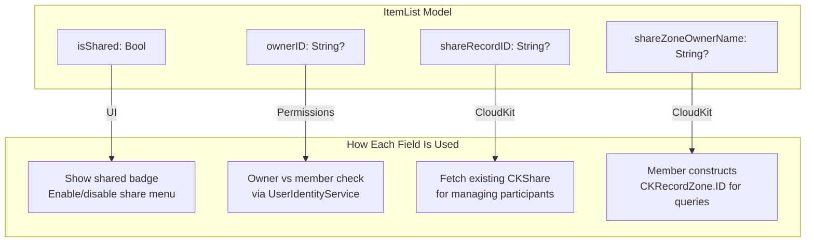

# CloudKit Sharing + SwiftData

A minimal, working reference project showing how to **share SwiftData records between users via CloudKit** — with permission-based access, share invitations, and real-time collaboration.

This is the pattern Apple barely documents. Their WWDC sessions mention `CKShare` and `UICloudSharingController` in passing, but there's no end-to-end example connecting SwiftData models to CloudKit sharing with proper permission management. This repo is that example.

> Extracted from [ToMe](https://framara.net/projects/ToMe), an iOS app for saving and organizing content from anywhere.

## The Problem

You want users to share a list (or folder, project, space) with other people:

| Requirement | Challenge |
|-------------|-----------|
| Owner creates a share | Must create a `CKShare` linked to a record in a **custom zone** (default zone doesn't support sharing) |
| Invite via link | Must use `UICloudSharingController` — Apple's built-in UI |
| Accept invitation | Must implement `userDidAcceptCloudKitShareWith` on a **scene delegate** and run `CKAcceptSharesOperation` |
| Permission control | Owner can do anything. Members can add/edit but only delete their own items |
| Leave / stop sharing | Must clean up both CloudKit records and local SwiftData state |
| No iCloud account | App must still work — graceful fallback to local-only mode |

SwiftData handles iCloud sync for private data automatically, but **sharing between users** requires manual CloudKit work that isn't documented well.

## The Solution

### 1. Custom Zone for Sharing

Records in the default zone **cannot be shared**. This is the #1 thing people miss. You must create a custom zone:

```swift
private let sharingZone = CKRecordZone(zoneName: "SharedLists")

// Ensure zone exists before creating shares
_ = try await container.privateCloudDatabase.save(sharingZone)
```

### 2. CKShare Creation with Parent References

Create a root `CKRecord` and link a `CKShare` to it. Both must be saved atomically. **Child item records must set `record.parent` to the list record** — without this, items exist in the zone but are not part of the CKShare hierarchy, so members cannot see them:

```swift
let listRecord = CKRecord(recordType: "SharedList", recordID: recordID)
let share = CKShare(rootRecord: listRecord)
share[CKShare.SystemFieldKey.title] = "My List" as CKRecordValue

// Save both atomically — this is required
let operation = CKModifyRecordsOperation(recordsToSave: [listRecord, share])
operation.isAtomic = true
container.privateCloudDatabase.add(operation)

// When adding items, link them to the shared list record:
let itemRecord = CKRecord(recordType: "SharedListItem", recordID: itemRecordID)
itemRecord.parent = CKRecord.Reference(recordID: listRecordID, action: .none) // CRITICAL
```

### 3. Share Acceptance Flow

This is the part most developers get stuck on. Apple calls your scene delegate, not the app delegate:



### 4. Owner vs Member Database

The key insight most developers miss — owner and member use **different databases** to access the **same data**:



The member must store the owner's `zoneID.ownerName` locally (we use `shareZoneOwnerName` on the model) to construct the correct zone ID for queries.

### 5. Permission Manager

Every UI action is gated by centralized permission checks:

| Action | Owner | Member |
|--------|:-----:|:------:|
| Add items | Yes | Yes |
| Edit any item | Yes | Yes |
| Delete own items | Yes | Yes |
| Delete others' items | Yes | **No** |
| Edit list metadata | Yes | **No** |
| Delete list | Yes | **No** |
| Manage sharing | Yes | **No** |
| Leave shared list | **No** | Yes |

This demo intentionally allows private read/write participants only (`.allowReadWrite` + `.allowPrivate` in `UICloudSharingController`). Read-only participants are not exposed in the sharing UI.

### 6. Three-Layer Real-Time Sync

Keeping shared lists in sync requires multiple mechanisms working together. No single approach is reliable on its own:



**Why three layers?**
- The **5-second polling timer** is the primary mechanism. CloudKit push notifications are unreliable on dev devices and can be delayed in production.
- **CloudKit push notifications** (`CKDatabaseSubscription` for members, `CKRecordZoneSubscription` for owners) provide faster sync when they work — they're registered on app launch and deliver silent pushes.
- The **`NSPersistentStoreRemoteChange` bridge** in `DataManager` catches SwiftData's own iCloud sync events and reposts them as `.modelContextDidSave`, ensuring views refresh when the underlying Core Data store merges remote changes.

### 7. Graceful Fallback

If the user isn't signed into iCloud, the app falls back to local-only mode:

```swift
// DataManager tries CloudKit first, falls back to local
let cloudConfig = ModelConfiguration(schema: schema, cloudKitDatabase: .automatic)
do {
    return try ModelContainer(for: schema, configurations: [cloudConfig])
} catch {
    // No iCloud → local-only mode
    let localConfig = ModelConfiguration(schema: schema, cloudKitDatabase: .none)
    return try ModelContainer(for: schema, configurations: [localConfig])
}
```

The UI shows an orange "iCloud Not Available" banner and disables sharing features.

## Architecture

### High-Level Overview



### Service Layer



### Share Acceptance Pipeline

When a user taps a CloudKit share link, the acceptance flows through three components:



### Sync Architecture



### Sharing Metadata Flow



## Project Structure

```
CloudKitSharing/
├── project.yml                        # XcodeGen project definition
├── App/
│   └── Resources/
│       ├── App.entitlements           # iCloud + CloudKit entitlements
│       └── Info.plist                 # UIBackgroundModes, CKSharingSupported
│
└── Sources/
    ├── Shared/                        ← Shared code
    │   ├── Models/
    │   │   ├── ItemList.swift         # @Model — shareable list with CK metadata
    │   │   ├── ListItem.swift         # @Model — item with creator tracking
    │   │   └── SchemaVersions.swift   # Versioned schemas + migration plan
    │   └── Services/
    │       ├── DataManager.swift      # SwiftData container + CloudKit fallback
    │       │                          #   + NSPersistentStoreRemoteChange bridge
    │       ├── SharingManager.swift   # CKShare creation, acceptance, item sync,
    │       │                          #   CloudKit subscriptions, push handling
    │       ├── PermissionManager.swift# Owner/member permission checks
    │       └── UserIdentityService.swift # CloudKit user identity resolution
    │
    └── App/                           ← Main app
        ├── CloudKitSharingApp.swift   # Entry point with:
        │                              #   - AppDelegate (push registration,
        │                              #     subscription setup, remote notification)
        │                              #   - SceneDelegate (share acceptance)
        │                              #   - CloudKitShareCoordinator (ObservableObject)
        │                              #   - CloudKitShareHandler (invisible overlay)
        │                              #   - Seed data
        ├── CloudSharingView.swift     # UICloudSharingController wrapper
        ├── ListsView.swift            # All lists + iCloud status banner
        └── ListDetailView.swift       # Items + permission-aware actions
                                       #   + 5s polling timer + sync listeners
```

## Quick Start

The project uses [XcodeGen](https://github.com/yonaskolb/XcodeGen) to generate the `.xcodeproj` from `project.yml`.

```bash
# 1. Install XcodeGen (if you don't have it)
brew install xcodegen

# 2. Set your Development Team and Container ID
#    Open project.yml:
#    - Set DEVELOPMENT_TEAM to your team ID (currently empty: "")
#    - Replace "com.example" with your domain in bundleIdPrefix, entitlements, and bundle identifier
#    Update AppConstants.cloudKitContainerID in DataManager.swift to match

# 3. Generate the Xcode project
xcodegen generate

# 4. Open and run
open CloudKitSharing.xcodeproj
```

### Why is the Development Team required?

CloudKit requires a valid provisioning profile — even on the Simulator. Without a `DEVELOPMENT_TEAM`:
- The app builds but CloudKit operations fail with authentication errors
- The iCloud container cannot be registered
- `com.example` is reserved by Apple and cannot be used as a container ID

Set your team ID in `project.yml` at `settings.base.DEVELOPMENT_TEAM` (currently set to `""` — you must replace this). You can find it in Xcode under **Signing & Capabilities**, or in your [Apple Developer account](https://developer.apple.com/account).

### Customizing for your app

1. Set `DEVELOPMENT_TEAM` in `project.yml`
2. Replace `com.example` with your domain in `project.yml` (bundleIdPrefix, entitlements, bundle identifier)
3. Update the container ID in `App/Resources/App.entitlements`
4. Update `AppConstants.cloudKitContainerID` in `DataManager.swift`
5. Update the container ID in `SharingManager.swift` logger subsystem
6. Regenerate: `xcodegen generate`

### CloudKit Dashboard

After running the app once with a valid team ID, go to the [CloudKit Dashboard](https://icloud.developer.apple.com/) and verify:

1. Your container exists
2. The `SharedLists` zone will be created automatically on first share
3. Record types (`SharedList`, `SharedListItem`) appear after first use

## Key Patterns

### Creating a Share

```swift
// SharingManager handles zone creation, record setup, and CKShare linking
let (share, container) = try await SharingManager.shared.fetchOrCreateShare(
    for: list, context: modelContext
)

// Present Apple's built-in sharing UI
CloudSharingView(list: list, context: context, container: container, share: share)
```

### Parent References (Critical for CKShare Hierarchy)

Item CKRecords **must** have `record.parent` set to the list record. Without this, items exist in the shared zone but are not part of the CKShare hierarchy — members will not see them:

```swift
let listRecordID = CKRecord.ID(recordName: "List-\(list.id.uuidString)", zoneID: zoneID)
let parentRef = CKRecord.Reference(recordID: listRecordID, action: .none)

let itemRecord = CKRecord(recordType: "SharedListItem", recordID: itemRecordID)
itemRecord["itemID"] = item.id.uuidString as CKRecordValue
itemRecord["listID"] = list.id.uuidString as CKRecordValue
itemRecord["text"] = item.text as CKRecordValue
itemRecord.parent = parentRef  // CRITICAL — links item into CKShare hierarchy
```

This pattern is used in both `pushItem()` (single item) and `pushAllItems()` (batch push when sharing is first created).

### Accepting a Share (Scene Delegate)

The scene delegate — not the app delegate — receives share invitations:

```swift
class SceneDelegate: NSObject, UIWindowSceneDelegate {
    // Called when user taps a share link while the app is running
    func windowScene(
        _ windowScene: UIWindowScene,
        userDidAcceptCloudKitShareWith metadata: CKShare.Metadata
    ) {
        CloudKitShareCoordinator.shared.handleShareMetadata(metadata)
    }

    // Called when the app is launched via a share link
    func scene(_ scene: UIScene, willConnectTo session: UISceneSession,
               options connectionOptions: UIScene.ConnectionOptions) {
        if let metadata = connectionOptions.cloudKitShareMetadata {
            CloudKitShareCoordinator.shared.handleShareMetadata(metadata)
        }
    }
}
```

The `CloudKitShareHandler` (invisible SwiftUI overlay) picks up the metadata and calls:

```swift
let list = try await SharingManager.shared.acceptShare(metadata, context: modelContext)
```

### CloudKit Subscriptions (Push-Based Sync)

Two subscriptions are registered on app launch for real-time sync via silent push notifications:

```swift
// 1. CKDatabaseSubscription on sharedCloudDatabase
//    → Notifies MEMBERS when the owner (or other members) change items
let sharedDBSub = CKDatabaseSubscription(subscriptionID: "SharedListsSubscription")
sharedDBSub.notificationInfo = notificationInfo  // shouldSendContentAvailable = true
_ = try await container.sharedCloudDatabase.modifySubscriptions(saving: [sharedDBSub], deleting: [])

// 2. CKRecordZoneSubscription on privateCloudDatabase (SharedLists zone)
//    → Notifies the OWNER when members change items in the shared zone
let zoneSub = CKRecordZoneSubscription(zoneID: sharingZone.zoneID, subscriptionID: "SharedListsZoneSubscription")
zoneSub.notificationInfo = notificationInfo
_ = try await container.privateCloudDatabase.modifySubscriptions(saving: [zoneSub], deleting: [])
```

When a silent push arrives, `AppDelegate.didReceiveRemoteNotification` calls `SharingManager.handleRemoteNotification()`, which syncs all shared lists and posts `itemsDidSyncNotification`.

### NSPersistentStoreRemoteChange Bridge

`DataManager` forwards CloudKit remote-change notifications so views that listen for `.modelContextDidSave` also refresh when data arrives from another device via iCloud sync:

```swift
remoteChangeObserver = NotificationCenter.default.addObserver(
    forName: .NSPersistentStoreRemoteChange,
    object: nil,
    queue: .main
) { _ in
    NotificationCenter.default.post(name: .modelContextDidSave, object: nil)
}
```

`ListDetailView` observes `.modelContextDidSave` to trigger a re-sync, which ensures `@Query` picks up new items merged into the underlying Core Data store.

### Polling Timer (Primary Sync Mechanism)

CloudKit push notifications are unreliable on dev devices and can be delayed in production. The primary sync mechanism is a 5-second polling timer on the detail view:

```swift
// ListDetailView
.onReceive(Timer.publish(every: 5, on: .main, in: .common).autoconnect()) { _ in
    guard list.isShared else { return }
    Task { await syncSharedItems() }
}
```

This is the same pattern used in ToMe. The timer only runs while the shared list detail view is visible.

### Ended-Share Health Check

`ListsView` also checks shared-list availability on appear and every 30 seconds. If a share is revoked (or the zone disappears), `SharingManager.checkForEndedSharing(...)` converts the list to local and posts `sharingEndedNotification`.

### Permission Checks

```swift
// Before showing delete button
if PermissionManager.shared.canDelete(item: item, in: list) {
    Button("Delete", role: .destructive) { deleteItem() }
}

// Before showing share option
if PermissionManager.shared.canShareList(list) {
    Button("Share List") { presentSharing() }
}

// Before enabling input bar
if PermissionManager.shared.canAddItem(to: list) {
    inputBar
}
```

### User Identity Resolution

```swift
// UserIdentityService resolves CloudKit user record ID on launch
// Falls back to local device UUID if iCloud unavailable
await UserIdentityService.shared.ensureIdentityResolved()

// Check ownership
UserIdentityService.shared.isCurrentUserOwner(of: list)  // → Bool
UserIdentityService.shared.didCurrentUserCreate(item)     // → Bool
```

### Tracking Item Creator

```swift
// When creating items, stamp the current user ID
let item = ListItem(
    text: "New item",
    createdByUserID: UserIdentityService.shared.currentUserID
)
```

This enables "members can only delete their own items" in `PermissionManager`.

### Stop Sharing / Leave

```swift
// Owner stops sharing — removes CKShare, clears metadata
try await SharingManager.shared.stopSharing(list, context: modelContext)

// Member leaves — deletes local copy
try await SharingManager.shared.leaveSharedList(list, context: modelContext)
```

## Sharing Metadata on the Model

The `ItemList` model carries CloudKit sharing state locally:

```swift
@Model final class ItemList {
    // ... standard fields ...

    var isShared: Bool = false            // CKShare exists for this list
    var ownerID: String?                  // Owner's CloudKit user record name
    var shareRecordID: String?            // CKShare.recordID.recordName
    var shareZoneOwnerName: String?       // CKRecordZone.ID.ownerName (for members)
    var lastSharedUpdatedAt: Date?        // Timestamp of last CloudKit sync
    var isPro: Bool = true                // Subscription gating placeholder (always true in demo)
}
```

These fields let the app reconstruct the correct `CKRecordZone.ID` and `CKRecord.ID` for both owner and member without hitting CloudKit every time.

## Common Pitfalls

| Pitfall | Solution |
|---------|----------|
| Sharing records in default zone | Use a **custom zone** — default zone records cannot be shared |
| `CKShare` not linked to record | Save both root record and share in one atomic `CKModifyRecordsOperation` |
| Members can't see items | Item CKRecords must set `record.parent` to the list record — without this, items exist in the zone but are **not part of the CKShare hierarchy** |
| Share acceptance does nothing | Implement `userDidAcceptCloudKitShareWith` on a **scene delegate**, not the app delegate |
| Member can't find shared records | Member must use `sharedCloudDatabase` with the owner's `zoneID.ownerName` |
| CloudKit pushes are unreliable | Use a **5-second polling timer** as the primary sync mechanism; treat push notifications as a bonus layer |
| Views don't refresh on remote sync | Bridge `NSPersistentStoreRemoteChange` to a custom notification and observe it in views to trigger re-sync |
| `@Query` doesn't update from other contexts | `syncItems` runs in the view's own `ModelContext`; also listen for `itemsDidSyncNotification` after push-handler syncs in a separate context |
| Permission errors after sharing | Always check `PermissionManager` before destructive actions — the server will reject unauthorized writes |
| User identity is nil on launch | Call `ensureIdentityResolved()` before critical operations — the fetch is async |
| `UICloudSharingController` crashes | Must pass a valid `CKShare` and `CKContainer` — fetch or create the share first |
| Read-only participant behavior is inconsistent | This demo intentionally disables `.allowReadOnly`; it supports private + read/write participants only |
| Shared list appears twice | Check by list UUID before creating a local copy on share acceptance |
| App crashes without iCloud | Fall back to `cloudKitDatabase: .none` and show a banner (see `DataManager`) |
| CloudKit push errors in console | Add `remote-notification` to `UIBackgroundModes` in Info.plist |
| `rootRecordID` deprecation warning | Use `hierarchicalRootRecordID` (iOS 16+) instead |
| App renders in small window | Include `UILaunchScreen` in Info.plist (set via `INFOPLIST_KEY_UILaunchScreen_Generation: YES`) |
| Subscription already exists error | Catch `CKError.serverRejectedRequest` when registering subscriptions — it means the subscription already exists |

## Known Limitations

- This demo intentionally supports private + read/write participants only (`.allowReadWrite` + `.allowPrivate`). Read-only participants are not exposed.
- Item sync currently handles create/delete flows (including remote-delete protection). It does not yet implement full field-level conflict resolution for concurrent edits.
- Real-time behavior still depends on CloudKit delivery conditions; the 5-second polling layer is the primary reliability mechanism.

## Schema Migrations

When you need to add a field after your first release:

```swift
// 1. Add the optional field to the model
@Model final class ItemList {
    // ... existing fields ...
    var memberCount: Int? = nil  // NEW — optional + default = lightweight migration
}

// 2. Create a new schema version
enum SchemaV2: VersionedSchema {
    static let versionIdentifier = Schema.Version(1, 1, 0)
    static var models: [any PersistentModel.Type] { [ItemList.self, ListItem.self] }
}

// 3. Add to the migration plan
enum AppMigrationPlan: SchemaMigrationPlan {
    static var schemas: [any VersionedSchema.Type] {
        [SchemaV1.self, SchemaV2.self]
    }
    static var stages: [MigrationStage] { [] }  // Additive optionals = automatic
}
```

## How It Differs from SwiftData + App Group Sharing

| Concern | [SwiftDataSharing](https://github.com/framara/SwiftDataSharing) | This Project |
|---------|----------------------|--------------|
| Sharing model | Same database, multiple **targets** | Same data, multiple **users** |
| CloudKit mode | `.none` (local only) | `.automatic` with local fallback |
| CKShare | Not used | Core of the architecture |
| Scene delegate | Not needed | Required for share acceptance |
| Permission system | Not needed | Owner vs member roles |
| User identity | Not needed | CloudKit user record ID |
| Background modes | Not needed | `remote-notification` for CloudKit pushes |
| Entitlements | App Groups | iCloud + CloudKit |

## Requirements

- iOS 17.0+
- Xcode 16+
- Swift 6
- [XcodeGen](https://github.com/yonaskolb/XcodeGen) (`brew install xcodegen`)
- Apple Developer account (for CloudKit container registration)
- iCloud account on device (for sharing features; app works locally without it)

## Credits

Extracted from [ToMe](https://framara.net/projects/ToMe) by [framara](https://framara.net).

## License

MIT
