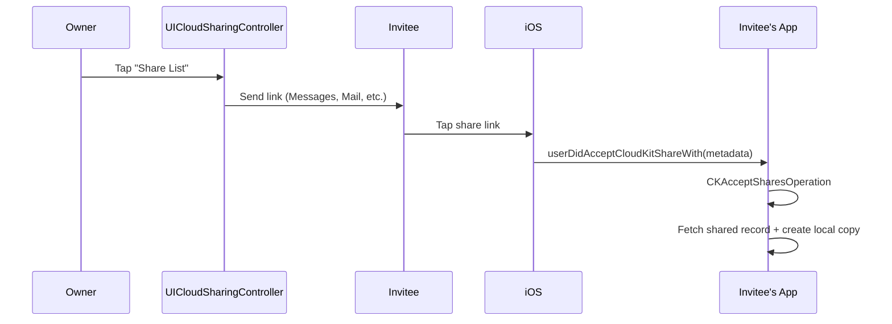
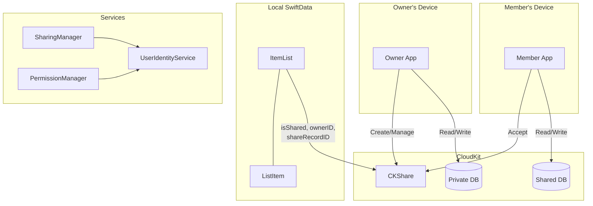

# CloudKit Sharing + SwiftData

A minimal, working reference project showing how to **share SwiftData records between users via CloudKit** — with permission-based access, share invitations, and real-time collaboration.

This is the pattern Apple barely documents. Their WWDC sessions mention `CKShare` and `UICloudSharingController` in passing, but there's no end-to-end example connecting SwiftData models to CloudKit sharing with proper permission management. This repo is that example.

> Extracted from [ToMe](https://framara.net/projects/ToMe), an iOS app for saving and organizing content from anywhere.

## The Problem

You want users to share a list (or folder, project, space) with other people:

| Requirement | Challenge |
|-------------|-----------|
| Owner creates a share | Must create a `CKShare` linked to a record in a **custom zone** (default zone doesn't support sharing) |
| Invite via link | Must use `UICloudSharingController` — Apple's built-in UI |
| Accept invitation | Must implement `userDidAcceptCloudKitShareWith` on a **scene delegate** and run `CKAcceptSharesOperation` |
| Permission control | Owner can do anything. Members can add/edit but only delete their own items |
| Leave / stop sharing | Must clean up both CloudKit records and local SwiftData state |

SwiftData handles iCloud sync for private data automatically, but **sharing between users** requires manual CloudKit work that isn't documented well.

## The Solution

### 1. Custom Zone for Sharing

Records in the default zone **cannot be shared**. You must create a custom zone:

```swift
private let sharingZone = CKRecordZone(zoneName: "SharedLists")

// Ensure zone exists before creating shares
_ = try await container.privateCloudDatabase.save(sharingZone)
```

### 2. CKShare Creation

Create a root `CKRecord` and link a `CKShare` to it:

```swift
let listRecord = CKRecord(recordType: "SharedList", recordID: recordID)
let share = CKShare(rootRecord: listRecord)
share[CKShare.SystemFieldKey.title] = "My List" as CKRecordValue

// Save both atomically
let operation = CKModifyRecordsOperation(recordsToSave: [listRecord, share])
operation.isAtomic = true
container.privateCloudDatabase.add(operation)
```

### 3. Share Acceptance Flow

This is the part most developers get stuck on:



### 4. Owner vs Member Database

The key insight most developers miss:

```
Owner  → privateCloudDatabase  (their own zone)
Member → sharedCloudDatabase   (owner's zone, accessed via ownerName)
```

Both access the **same logical data** through different databases. The member must use the owner's `zoneID.ownerName` to construct the correct zone ID.

### 5. Permission Manager

Every UI action is gated by centralized permission checks:

| Action | Owner | Member |
|--------|:-----:|:------:|
| Add items | Yes | Yes |
| Edit any item | Yes | Yes |
| Delete own items | Yes | Yes |
| Delete others' items | Yes | No |
| Edit list metadata | Yes | No |
| Delete list | Yes | No |
| Manage sharing | Yes | No |
| Leave shared list | No | Yes |

## Architecture



## Project Structure

```
Sources/
├── Shared/                            ← Shared code
│   ├── Models/
│   │   ├── ItemList.swift             # @Model — shareable list with CK metadata
│   │   ├── ListItem.swift             # @Model — item with creator tracking
│   │   └── SchemaVersions.swift       # Versioned schemas + migration plan
│   └── Services/
│       ├── DataManager.swift          # SwiftData container (cloudKitDatabase: .automatic)
│       ├── SharingManager.swift       # CKShare creation, acceptance, lifecycle
│       ├── PermissionManager.swift    # Owner/member permission checks
│       └── UserIdentityService.swift  # CloudKit user identity resolution
│
└── App/                               ← Main app
    ├── CloudKitSharingApp.swift       # Entry point + share acceptance handling
    ├── CloudSharingView.swift         # UICloudSharingController wrapper
    ├── ListsView.swift                # All lists with sharing badges
    └── ListDetailView.swift           # Items + permission-aware actions
```

## Quick Start

The project uses [XcodeGen](https://github.com/yonaskolb/XcodeGen) to generate the `.xcodeproj` from `project.yml`.

```bash
# 1. Install XcodeGen (if you don't have it)
brew install xcodegen

# 2. Set your Development Team
#    Open project.yml and set DEVELOPMENT_TEAM to your team ID

# 3. Generate the Xcode project
xcodegen generate

# 4. Open and run
open CloudKitSharing.xcodeproj
```

### Why is the Development Team required?

CloudKit requires a valid provisioning profile — even on the Simulator. Without a `DEVELOPMENT_TEAM`, the app will build but CloudKit operations will fail with authentication errors.

Set your team ID in `project.yml` at `settings.base.DEVELOPMENT_TEAM`. You can find it in Xcode under **Signing & Capabilities**, or in your [Apple Developer account](https://developer.apple.com/account).

### CloudKit Dashboard Setup

After running the app once with a valid team ID, go to the [CloudKit Dashboard](https://icloud.developer.apple.com/) and verify:

1. Your container (`iCloud.com.example.cloudkitsharing`) exists
2. The `SharedLists` zone will be created automatically on first share

> You can rename the container ID in `AppConstants.cloudKitContainerID` and in `project.yml` entitlements.

## Key Patterns

### Creating a Share

```swift
// SharingManager handles zone creation, record setup, and CKShare linking
let (share, container) = try await SharingManager.shared.fetchOrCreateShare(
    for: list, context: modelContext
)

// Present Apple's built-in sharing UI
CloudSharingView(list: list, context: context, container: container, share: share)
```

### Accepting a Share (Scene Delegate)

```swift
class SceneDelegate: NSObject, UIWindowSceneDelegate {
    func windowScene(
        _ windowScene: UIWindowScene,
        userDidAcceptCloudKitShareWith metadata: CKShare.Metadata
    ) {
        CloudKitShareCoordinator.shared.handleShareMetadata(metadata)
    }
}
```

The `CloudKitShareHandler` (invisible SwiftUI overlay) picks up the metadata and calls:

```swift
let list = try await SharingManager.shared.acceptShare(metadata, context: modelContext)
```

### Permission Checks

```swift
// Before showing delete button
if PermissionManager.shared.canDelete(item: item, in: list) {
    Button("Delete", role: .destructive) { deleteItem() }
}

// Before showing share option
if PermissionManager.shared.canShareList(list) {
    Button("Share List") { presentSharing() }
}
```

### User Identity Resolution

```swift
// UserIdentityService resolves CloudKit user record ID on launch
await UserIdentityService.shared.ensureIdentityResolved()

// Check ownership
UserIdentityService.shared.isCurrentUserOwner(of: list)  // → Bool
UserIdentityService.shared.didCurrentUserCreate(item)     // → Bool
```

### Tracking Item Creator

```swift
// When creating items, stamp the current user ID
let item = ListItem(
    text: "New item",
    createdByUserID: UserIdentityService.shared.currentUserID
)
```

This enables "members can only delete their own items" in `PermissionManager`.

## Sharing Metadata on the Model

The `ItemList` model carries CloudKit sharing state:

```swift
@Model final class ItemList {
    // ... standard fields ...

    var isShared: Bool = false            // CKShare exists for this list
    var ownerID: String? = nil            // Owner's CloudKit user record name
    var shareRecordID: String? = nil      // CKShare.recordID.recordName
    var shareZoneOwnerName: String? = nil // CKRecordZone.ID.ownerName (for members)
}
```

These fields let the app reconstruct the correct `CKRecordZone.ID` and `CKRecord.ID` for both owner and member without hitting CloudKit every time.

## Common Pitfalls

| Pitfall | Solution |
|---------|----------|
| Sharing records in default zone | Use a **custom zone** — default zone records cannot be shared |
| `CKShare` not linked to record | Save both root record and share in one atomic `CKModifyRecordsOperation` |
| Share acceptance does nothing | Implement `userDidAcceptCloudKitShareWith` on a **scene delegate**, not the app delegate |
| Member can't find shared records | Member must use `sharedCloudDatabase` with the owner's `zoneID.ownerName` |
| Permission errors after sharing | Always check `PermissionManager` before destructive actions — the server will reject unauthorized writes |
| User identity is nil | Call `ensureIdentityResolved()` before critical operations — the fetch is async |
| `UICloudSharingController` crashes | Must pass a valid `CKShare` and `CKContainer` — fetch or create the share first |
| Shared list appears twice | Check by list UUID before creating a local copy on share acceptance |
| App renders in small window | Include `UILaunchScreen` in Info.plist (set via `INFOPLIST_KEY_UILaunchScreen_Generation: YES`) |

## How It Differs from SwiftData + App Group Sharing

| Concern | [SwiftDataSharing](https://github.com/framara/SwiftDataSharing) | This Project |
|---------|----------------------|--------------|
| Sharing model | Same database, multiple targets | Same data, multiple **users** |
| CloudKit mode | `.none` (local only) | `.automatic` (iCloud sync + sharing) |
| CKShare | Not used | Core of the architecture |
| Scene delegate | Not needed | Required for share acceptance |
| Permission system | Not needed | Owner vs member roles |
| User identity | Not needed | CloudKit user record ID |

## Requirements

- iOS 17.0+
- Xcode 16+
- Swift 6
- [XcodeGen](https://github.com/yonaskolb/XcodeGen) (`brew install xcodegen`)
- iCloud account (for sharing features)

## Credits

Extracted from [ToMe](https://framara.net/projects/ToMe) by [framara](https://framara.net).

## License

MIT
